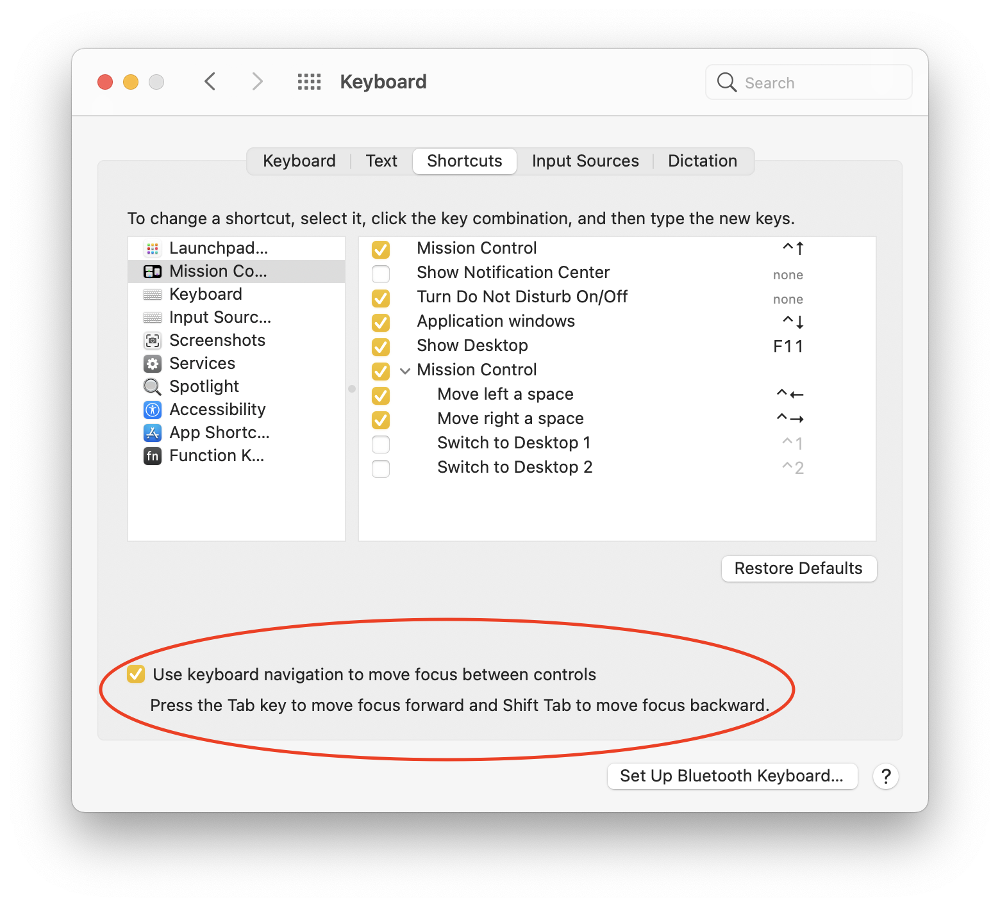

# Keyboard Focus

## Prerequisite info

AppKit provides built in functionality for automatically handling keyboard focus on a window via two methods:

- The Key View Loop, the loop of controls that receive keyboard focus while the user presses Tab / Shift+Tab
- Specific AppKit controls that allow you to move selection of an individual element with arrow keys, such as: NSSegmentedControl, NSTableView, NSCollectionView

It is important to know that macOS by default does not add all controls to the key view loop. In order to enable that, you must enable the user setting at: _System Preferences -> Keyboard -> Shortcuts -> Use Keyboard Navigation to move focus between controls_



## Convention

It is recommended to let the window automatically calculate your key view loop for you. There are very few cases in which the automatically calculated key view loop is not sufficient, and in most cases the built in arrow key navigation of the AppKit controls mentioned above are a sufficient supplement.

## Rationale

Allowing the window to automatically calculate the key view loop (by setting `window.autoRecalculatesKeyViewLoop = true`), you can:

- Better conform to the user's expectation of the key view loop laid out in geometric order (left to right, top to bottom for the english locale at the time of writing)
- Protect against future OS updates where Apple may change the behavior of the key-view loop.
- Save yourself a lot of hassle of manually managing a key view loop

One thing to note: setting `autoRecalculatesKeyViewLoop` to `true` means that any NSView whose `nextKeyView` property you have manually set will be ignored. This is seemingly because AppKit will constantly recalculate the key view loop every time a view is added or the user tabs to a new view, stamping over any customizations to the key view loop done by  the developer.

Manually managing your own key-view loop (by setting `window.autoRecalculatesKeyViewLoop = false`) has a few major downsides:

- Doing so means you will have no key view loop except for whichever views you have manually set the `nextKeyView` property of in your project.
- Any call to `window.recalculateKeyViewLoop()` will stamp over your customizations, as we have already described.

## Alternatives

Rather than modifying the key view loop, consider if there is an existing AppKit control that could fit your needs. Both NSTableView and NSCollectionView will allow you to create a list / grid of views and use keyboard arrow keys to move selection between them. This plays nicely with the key view loop, as the entire table (in the case of NSTableView) is what receives focus, while the arrow keys select the individual row / element.

## Exceptions

If your window has a fairly static view hierarchy, it may be simple enough to set the nextKeyView properties for every applicable view. If you only have a few specific views whose `nextKeyView` property you want to modify, you can call `window.recalculateKeyViewLoop()` once to get an AppKit generated key view loop, and then set up your custom key views.

### Examples

To turn the automatic key view loop off:

```swift
class AppDelegate: NSObject, NSApplicationDelegate {

    func applicationWillFinishLaunching(_ notification: Notification) {
        // ... window setup code
        window.autorecalculatesKeyViewLoop = false
    }
}
```

Setting up your custom nextKeyView properties in your ViewController:

```swift
// Good: set the next key view in viewDidAppear() after a call to window.recalculateKeyViewLoop()
class TestViewController: NSViewController {
    override func viewDidAppear() {
        // Let AppKit generate a key view loop for you
        view.window?.recalculateKeyViewLoop()

        // Set up your own custom nextKeyViews
        fooView.nextKeyView = barView

        // Any subsequent call to window.recalculateKeyViewLoop()
        // will overwrite the nextKeyView of fooView
    }
}
```

```swift
// Bad: fooView.nextKeyView is immediately overwritten by the subsequent call to window.recalculateKeyViewLoop()
class TestViewController: NSViewController {
    override func viewDidAppear() {
        fooView.nextKeyView = barView
        view.window?.recalculateKeyViewLoop()
    }
}
```

```swift
// Bad: Setting the nextKeyView in viewDidLoad will do nothing, as the window is not guaranteed to be available yet
class TestViewController: NSViewController {
    override func viewDidLoad() {
        view.window?.recalculateKeyViewLoop()
        fooView.nextKeyView = barView
    }
}
```

## References

<https://cocoadev.github.io/KeyViewLoopGuidelines/>
